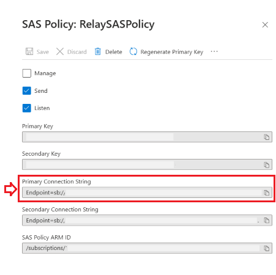
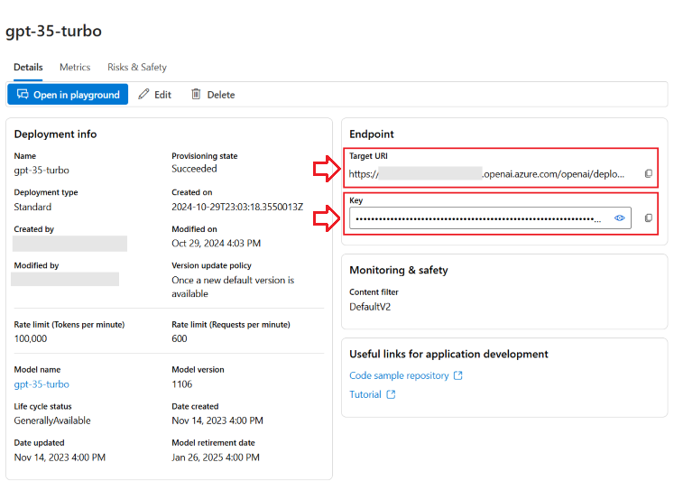
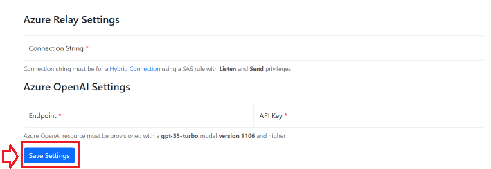
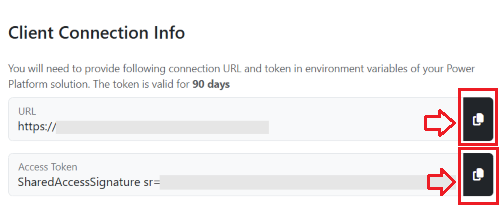

# Welcome

Microsoft Copilot App Flows (MCAF) allows you to bring your existing UI-based app workloads to the AI-driven copilot and agent interface. At the core, MCAF provides a runtime for executing complex business task involving multiple turns, branches, loops while interacting with the existing application UI in a headless browser in a fashion similar to how a real human user would do so. An MCAF process is described in a **Domain Specific Language** (DSL) with a number of built-in LLM-based intelligent capabilities.

MCAF is also integrated with the Microsoft Copilot Studio (MCS) allowing for its availability in supported MCS channels and the rest of the MCS ecosystem.

# Set-up steps

The cloned github repo (https://github.com/microsoft/copilot-app-flows) has two main directories: **/browser-automation** and **/solutions**. The /browser-automation directory contains the automation service which has both the maker experience and runtime. It has everything you need for a fast dev inner loop in creating DSL scripts and testing iteratively. The /solutions directory contains Power-Platform solutions enabling you to run the developed DSL in Microsoft Copilot Studio (MCS) and its configured channels either as an interactive or autonomous fashion.

#### Pre-requisites (one-time setup)
Two Azure services need to be created and configured:
1. Create an **Azure Relay** which serves the purpose of connecting MCS copilot with the local dev machine upon which the automation service is run.
   - Go to https://portal.azure.com and locate your favorite resource group (RG)
   - Provision an Azure relay
   - Create a *Hybrid Connection* (HC) in the relay. Make sure that the *Requires Client Authorization* option is checked.
   - In HC, go to *Settings -> Shared access policies* (a.k.s SAS Policy). Add a new SAS policy with **Send** & **Listen** privileges checked. Click *Create* to continue.
   - In the SAS policy details screen that appears, copy the **Primary Connection String** (PCS) and save it somewhere so that you can use it in the configuration settings below.
   
   
2. Provision an **Azure OpenAI** service which serves the endpoint for LLM interactions.
   - Go to https://portal.zure.com and in the same RG, create an Azure OpenAI resource (AOAI)
   - Under *Resource Management*, select *Model deployments*. Click on the *Manage Deployments*, it will take you to the **Azure OpenAI Studio**.
   - In the Azure OpenAI Studio,  click on *Deploy model* and choose *Deploy base model*. In the popup window, select the gpt-35-turbo and click *Confirm*
   - In the *Deploy model gpt-35-turbo* window, click on *Customize* and **make sure you choose 1106 as the model version** (not the default model). Click *Deploy* to provision this model.
   - On the deployment info page, copy the **Target URI** (TURI) and **Key** (KEY) for this model and save somewhere so that you can use them in the configuration settings below.
  
   
  
#### Configure and run automation service
Automation service can be run on any computer (e.g. a desktop, or a cloud virtual machine etc.). You need to make sure that you have a recent version of [Node.js](https://nodejs.org/en/download/package-manager) installed. Once properly configured and running, automation service can be accessed via your MCS bots anywhere.

1. Starting automation service -
   - From a cmdline, `cd` into the **/browser-automation** directory in your clone repo
   - If you have just cloned or pulled new changes, first run `npm install`
   - Launch the automation service by executing command `npm run start` **Note:** Automation service runs on the localhost port 7000. If that port is already in use, the start command will fail
   - If you have not previously configured the automation service, a browser will automatically open up to show the settings page. Please see the *Configuring automation service* section below for more details
   - Optionally, open your browser and go to http://localhost:7000, you should see the Microsoft Copilot App Flows (MCAF) home page. Navigate to the *Playground* page from the navigation bar to start developing your app flow
2. Configuring automation service -
   - Make sure that your automation service is up and running
   - In your web browser, navigate to the settings page http://localhost:7000/settings
   - Enter PCS, TURI, KEY from the Azure services that you provisioned in prerequisites steps above. Click on *Save Settings* to continue
  
   
   - Upon saving settings, you will see the *Client Connection Info* section appear or getting updated. Copy the URL (RelayURL) and Access Token (AT) which you will be entering as environment variables during solution import into your Power Platform environment below.
  
   

#### Connecting with a Power Platform environment
MCAF provides a companion Power Platform solution to connect with an environment. The solution contains a core Microsoft Copilot Studio (MCS) Topic named *ExecuteAppAction* which can work with the remote automation service running your computer via the provisioned Azure relay endpoint. You can create your own specialized topics (e.g. processing customer payment) which can internally call into the ExecuteAppAction topic with proper parameters to invoke the automation service. Being just standard topics in MCS, your topic will be engaged by the bot orchestrator based on the relevance matching on user's prompts/utterances.
1. Importing solution and configuring for MCS copilot experience
   - Go to the **/solutions** directory in the clone repo and locate the appactioncore_xxxx.zip solution file. The *xxxx* part indicates the version of the solution. Please choose the latest version available.
   - Go to the maker experience of your power-platform environment and import the solution zip.
   - During import, you will be prompted to configure the two required environment variables RelayEndpoint and RelaySASToken. Paste the values of RelayURL and AT respectively that you copied in a previous step.
2. Go to the Chatbots and click on the *AppActionCore* chatbot. You will be navigated to  MCS where you can explore the core *ExecuteAppAction* topic and other sample wrapping topics that were imported.
3. You have now completed the set-up!

# MCAF main capabilities
1. Maker experience is available in the [playground](/playground)
   - Use [playground](/playground) during active DSL development of your app flow. The playground is a web-based tool that allows you to test your DSL and see the results (including errors) in real-time.
   - Use intellisense in the playground to help write your DSL script.
   - Use the live-view and realtime logs in the Playground to debug and iterate over your DSL scripts.
   - DSL script's syntax is similar to JavaScript/TypeScript. Please refer to the [documentation](/dsl-guide) for more details.
2. MCS integration experience
   - Go to https://copilotstudio.microsoft.com and point it to the environment containing the imported solution from the release
   - Create an MCS topic, similar to the shipped 'Create Purchase Order', that redirects the base 'ExecuteAppAction' topic with a set of input including DSL scripts, app URL for running automation against.
   - Just like other copilots, you can test your copilot in the MCS and/or run it in a configured MCS channel (e.g., a demo web site) once publishing the solution.

